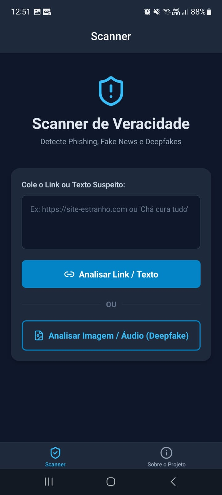
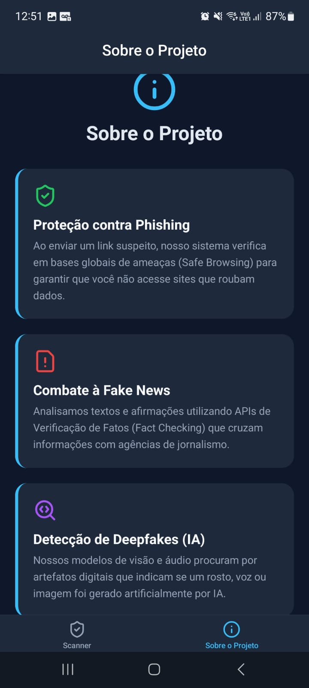

<h1 align="center">
  🛡️ Scanner Militar - Backend API
</h1>

<p align="center">
  
  
  
</p>

## 📌 Sobre o Projeto
Este é o **Servidor Backend** do projeto **Scanner de Veracidade Militar**. Ele funciona como um *Cérebro Central* de inteligência, protegendo as chaves de API restritas e servindo o aplicativo móvel React Native (Frontend). 

A API recebe Requisições do celular e as distribui para bancos de dados de segurança global (Google e Sightengine), retornando ao usuário se a informação é Verdadeira, Falsa, Maliciosa, ou gerada por Inteligência Artificial (Deepfakes).

*Nota: **O aplicativo Mobile em React Native e os prints de tela da interface estão no repositório separado ("scanner-app").***

---

## 📸 Demonstração do Aplicativo Mobile
<p align="center">
  
  
</p>

---

## 🚀 Funcionalidades da API

A API conta com três endpoints (`POST`) de verificação de conteúdos suspeitos:

### 1️⃣ Detecção de Phishing / Malware (Links)
- **Rota:** `/api/scan/link`
- **Motor de Busca:** Google Safe Browsing API v4
- **Como Funciona:** O aplicativo envia uma URL (ex: uma promoção de banco no WhatsApp). O servidor verifica na base mundial de Ameaças do Google se a URL é classificada como Software Malicioso, Engenharia Social, ou Phishing.
- **Saída:** 
  ```json
  { "url": "http://..", "isSafe": false, "threatType": "MALWARE", "message": "⚠️ Atenção..." }
  ```

### 2️⃣ Detecção de Fake News (Textos)
- **Rota:** `/api/scan/text`
- **Motor de Busca:** Google Fact Check Tools API
- **Como Funciona:**  O usuário digita uma notícia suspeita recebida. A API cruza o texto globalmente com publicações de Agências de Checagem oficiais (Lupa, Estadão Verifica, AFP, etc).
- **Saída:** O sistema retorna se a agência marcou a frase como "Enganosa/Falsa" e anexa a URL original com o desmentido verificado.

### 3️⃣ Detecção de Deepfake e IA (Mídias)
- **Rota:** `/api/scan/media`
- **Motor de Busca:** Sightengine GenAI
- **Como Funciona:** Recebe o *upload* de uma Foto ou Áudio via formulário (`multipart/form-data`) diretamente do celular do usuário. Analisa densidade de pixels para apontar qual é a porcentagem % daquela imagem ter sido gerada por Midjourney, DALL-E ou ser 100% orgânica.

---

## 🛠️ Como Instalar e Rodar na Nuvem (Render / Servidor Próprio)

Não é necessário enviar a pasta oculta `node_modules` para serviços de hospedagem como o [Render.com](https://render.com). O servidor baixará as dependências automaticamente lendo apenas estes 4 arquivos através do comando de build.

1. **Faça o Clone e Instale**
```bash
git clone https://github.com/SEU_USUARIO/backend-scanner.git
cd backend-scanner
npm install
```

2. **Crie suas Varáveis de Ambiente**
- Se você for rodar localmente, crie um arquivo chamado `.env` na pasta
- Se for rodar no Render, vá na aba `Environment Variables`
- Preencha com as suas próprias chaves (que são gratuitas pra testes nos sites oficiais):

```ini
PORT=3000
GOOGLE_SAFE_BROWSING_API_KEY=SuaChaveDoGoogleCloud
GOOGLE_FACT_CHECK_API_KEY=SuaChaveDoGoogleCloud
SIGHTENGINE_API_USER=SeuID
SIGHTENGINE_API_SECRET=SeuSecretId
```

3. **Inicie o Cérebro**
```bash
# Iniciar o servidor de Produção na Nuvem:
npm start

# Iniciar o servidor de Testes locais do Desenvolvedor:
npm run dev
```

---

<p align="center">
   <i>Feito para o Combate à Desinformação Digital.</i>
</p>
